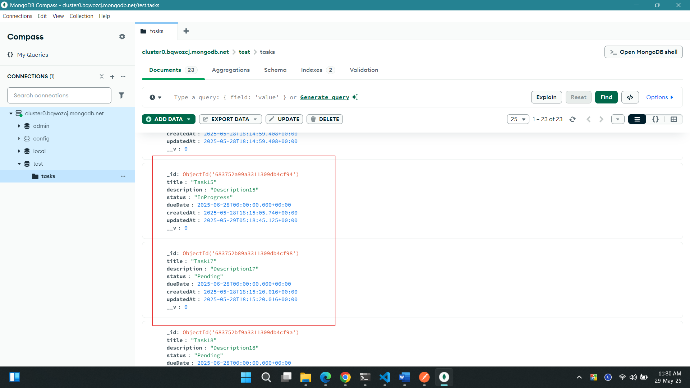
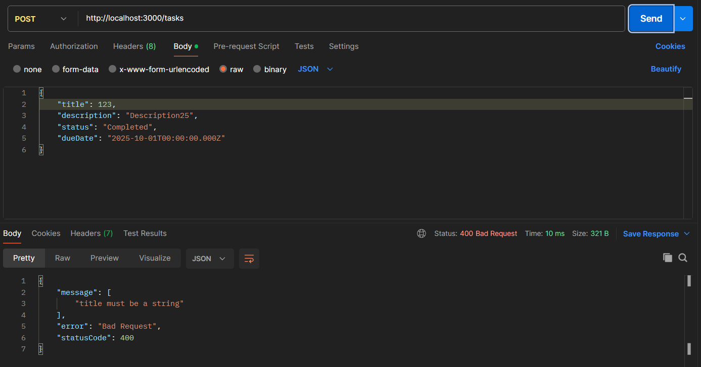

# Overview

A monolithic RESTful API for a Task Manager using NestJS & MongoDB.

## Project Initialization Steps
```bash
# Install NestJS CLI globally
$ npm i -g @nestjs/cli

# Create new project (Select npm)
$ nest new <project_name>

# watch mode
$ npm run start:dev
```

## Database
- MongoDB via Mongoose
- Configured connection via environment variables (e.g., MONGO_URI). 

```bash
# Install mongoose
$ npm i @nestjs/mongoose mongoose @nestjs/config
```

```ts
// .env
MONGO_URI=mongodb+srv://<username>:<password>@cluster0.bqwozcj.mongodb.net/
```

```ts
// app.module.ts
@Module({
  imports: [
    ConfigModule.forRoot({isGlobal: true}),
    MongooseModule.forRootAsync({
        imports: [ConfigModule],
        inject: [ConfigService],
        useFactory: async (config: ConfigService) => ({
            uri: config.get<string>('MONGO_URI')
        }),
    }),
    TasksModule,
  ],
  controllers: [AppController],
  providers: [AppService],
})
```

## Task Model
```sql
title: string (required, unique)
description: string (required)
status: "Pending" | "InProgress" | "Completed" (Default: "Pending")
dueDate: Date (Must be future date)
createdAt: Date (Auto-generated)
```
```ts
// task.schema.ts
@Schema({timestamps:{createdAt:true}})
export class Task {

    @Prop({required: true, unique:true})
    title: string;

    @Prop({required:true})
    description: string

    @Prop({
        enum: ['Pending', 'InProgress', 'Completed'],
        default: 'Pending'
    })
    status: string

    @Prop({
        required:true,
        validate:{
            validator: (value: Date) => value > new Date(),
            message: "dueDate has to be a future date."
        },
    })
    dueDate: Date;
}
export type TaskDocument = Task & Document;
export const TaskSchema = SchemaFactory.createForClass(Task);
```

## CRUD Endpoints
### Create task


### Fetch tasks

<p>Fetch using status query filter</p>

<p>Fetch a single task by id</p>


### Update a task
<p>Before update</p>

<p>After update</p>


### Delete a task
<p>Before deleting the task</p>

<p>After deleting the task</p>




## Validation & Error Handling
- Used class-validator for request validation. 
```ts
// create-task.dto.ts
import {IsEnum, IsNotEmpty, IsString, IsDateString, IsOptional} from 'class-validator'
export class CreateTaskDto {

    @IsString()
    @IsNotEmpty()
    title: string;

    @IsString()
    @IsNotEmpty()
    description: string

    @IsEnum(['Pending', 'InProgress', 'Completed'], {
        message: 'status must be either Pending, InProgress, or Completed'
    })
    @IsOptional()
    status?: string
    
    @IsDateString()
    @IsNotEmpty()
    dueDate: string
}
```
<p>Title must be a non-empty string</p>



<p>Status must be either Pending, InProgress, or Completed</p>


<p>dueDate has to be a future date</p>


- Returns 404 if task ID doesn’t exist.


- Handles duplicate titles with 409 Conflict.
```ts
// mongo-exception.filter.ts
@Catch()
export class MongoExceptionFilter implements ExceptionFilter {
  catch(exception: any, host: ArgumentsHost) {
    const ctx = host.switchToHttp();
    const response = ctx.getResponse<Response>();

    if (
      exception?.code === 11000 ||                            
      exception?.originalError?.code === 11000 ||      
      exception?.error?.code === 11000 ||                    
      exception?.writeErrors?.[0]?.code === 11000
    ) {
      const keyValue = exception?.keyValue || exception?.error?.keyValue || {};
      const field = Object.keys(keyValue)[0] || 'field';
      const value = keyValue[field] || '';
      return response.status(409).json({
       
        message: `Duplicate ${field} error: '${value}' already exists`,
        error: 'Conflict',
        statusCode: 409,
        
      });
    }
  }
}

```


## Pagination and sorting
```ts
// pagination-query.dto.ts
import { Type } from 'class-transformer';
import { IsEnum, IsIn, IsOptional, IsPositive } from 'class-validator';

export class PaginationQueryDto{

    //Pagination
    @IsOptional()
    @IsPositive()
    @Type(()=>Number)
    limit?: number;

    @IsOptional()
    @IsPositive()
    @Type(()=>Number)
    page?: number;

    //Sort by dueDate or createdAt
    @IsOptional()
    @IsIn(['createdAt','dueDate'])
    sortBy?: string;

    @IsOptional()
    @IsIn(['asc','desc'])
    sortOrder?: 'asc' | 'desc';

    //search by status query
    @IsOptional()
    @IsEnum(['Pending', 'InProgress', 'Completed'], {
        message: 'Status must be one of: Pending, InProgress, Completed',
    })
  status?: string;

}
```
```ts
// task.service.ts
async findAll(paginationQueryDto: PaginationQueryDto): Promise<Task[]> {

    const {
        page=1,
        limit=10,
        sortBy='createdAt',
        sortOrder='desc',
        status
    }=paginationQueryDto;

    const skip=(page - 1) * limit;

    const filter: any = {};
        if (status) {
            filter.status = status;
    }

    return this.taskModel
        .find(filter)
        .sort({[sortBy]: sortOrder === 'asc' ? 1 : -1})
        .skip(skip)
        .limit(limit)
        .exec();

  }
```


# Project setup
<p>Clone this repository.</p>

### Install Dependencies
```bash
$ npm install
```
### Set Up Environment Variables
```bash
$ cp .env.example .env
```
```bash
# .env
MONGO_URI = MongoDB connection string
```

### Compile and run the project

```bash
# development
$ npm run start

# watch mode
$ npm run start:dev

# production mode
$ npm run start:prod
```
<p>NestJS server should be running at:</p>

```bash
http://localhost:3000
```
<p>Test an endpoint like:</p>

```bash
GET http://localhost:3000/tasks
```

# License

Nest is [MIT licensed](https://github.com/nestjs/nest/blob/master/LICENSE).

<p align="center">
  <a href="http://nestjs.com/" target="blank"></a>
</p>

[circleci-image]: https://img.shields.io/circleci/build/github/nestjs/nest/master?token=abc123def456
[circleci-url]: https://circleci.com/gh/nestjs/nest

  <p align="center">A progressive <a href="http://nodejs.org" target="_blank">Node.js</a> framework for building efficient and scalable server-side applications.</p>
    <p align="center">
<a href="https://www.npmjs.com/~nestjscore" target="_blank"></a>
<a href="https://www.npmjs.com/~nestjscore" target="_blank"></a>
<a href="https://www.npmjs.com/~nestjscore" target="_blank"></a>
<a href="https://circleci.com/gh/nestjs/nest" target="_blank"></a>
<a href="https://discord.gg/G7Qnnhy" target="_blank"></a>
<a href="https://opencollective.com/nest#backer" target="_blank"></a>
<a href="https://opencollective.com/nest#sponsor" target="_blank"></a>
  <a href="https://paypal.me/kamilmysliwiec" target="_blank"></a>
    <a href="https://opencollective.com/nest#sponsor"  target="_blank"></a>
  <a href="https://twitter.com/nestframework" target="_blank"></a>
</p>
